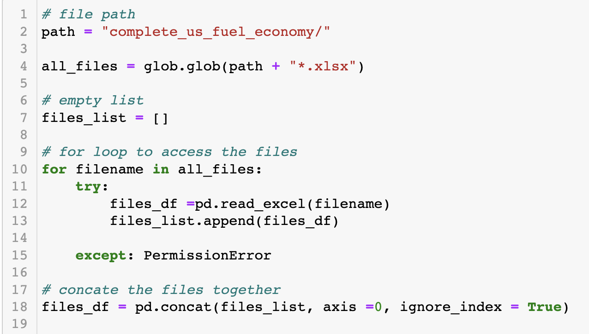
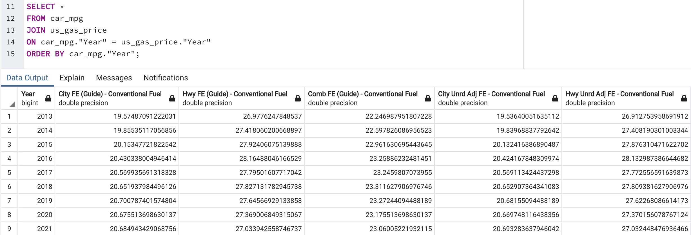

# Project2Team7

# Synopsis:

 Inflation has played a massive impact on how we spend our money. The most obvious indicator being gas prices. The vehicle you drive makes you realize how efficient is the fuel economy, and how much you have to pay at the pump as result. Our ETL will look into how the constant rise of gas prices have made car manufacturers produce cars with better MPG throughout time. More specifically the last 10 years. 

We will compare the average gasoline prices to the average fuel economy to the corresponding year. The data will be prepared by isolating the years of interest with their respective data followed extracting the data of interest from their csv files, and lastly, combining both datasets via pandas and sql.

# Extract:

The following list is our sources:

- https://www.kaggle.com/datasets/mruanova/us-gasoline-and-diesel-retail-prices-19952021
- This dataset contains the weekly national average of fuel prices from the year 1995-2021. The dataset also includes fuel prices of all grades and premiums, including diesel. Once we collected the data, we converted the csv to pandas framework. In terms of data cleaning, we wanted to average all the weekly fuel prices by the following year.

- https://www.kaggle.com/datasets/wandernat/us-hybrid-and-electric-sales-19992015
- This dataset contains the avergage fuel economy from all makes and models from 2008-2022. The datasets also includes transmission type, engine type, in addition to city and highway mpg. This dataset is an excel file, converting the dataset into a pandas framework. As this dataset contained massive amounts of information, it was paramount to clean our data include information that are relevant such as city and highway mpg. In addition, we utilized our data cleaning to gather fuel economy data by the following year.

In order to avoid hard-coding the extraction for each individual car detail file, an algorithm was created allowing for better reuse and modularity of code. A glob was created representing the directory with our car detail files. By iterating through the files in our glob, we're able to create dataframes, append them a list, and ultimately concatenate our dataframes together for simplicity.

# Transform:

Based on the information we wanted out of the data sets, we dropped a large amount of unnecessary columns and renamed many to be more relevant. Because the date format differed in our data sets, we wrote code to make the dates a uniform style and allowing for joins to be made. A groupby/mean was then performed on our fuel price data to average monthly fuel costs per year.

We then dropped values from our data that fell out of our time range of interest, 2013-2021.  Our foreign key columns were also renamed to be in line with postgres conventions.

# Load:

Using Postgres, we executed a query to join the car and fuel tables created in Python. The result is sorted chronologically to make it easier to notice trends over time. The join is made across the Year columns to match each car with the price of fuel the year they were released.

The data suggests that each year, fuel prices are raising, and cars are becoming more fuel efficient. With a few changes to our queries, we could elaborate on other variables that may affect trends. For instance, we could group cars by manufacturer in order to discern whether some have been more conscience of fuel efficiency than others. We could also reference manufacturers with their country of origin to determine whether nations have different attitudes in terms of demanding more fuel efficient vehicles.

